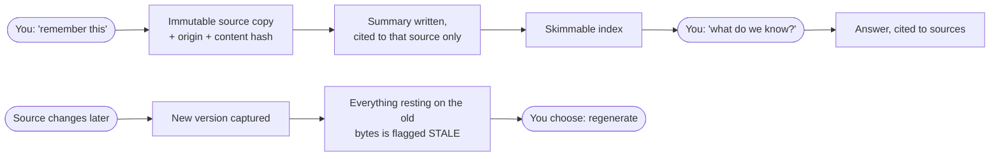

<!--
  README for the WillCAboutThat/odin-adapter marketplace repo.
  SOURCE OF TRUTH: project-odin (adapters/claude-plugin/marketplace-README.md).
  The publish workflow copies it verbatim on every release; do not edit it in
  the odin-adapter repo; it will be overwritten (that repo is a build artifact).
-->
# odin-adapter: the Odin plugin, for Claude Code and Codex CLI

## The names, in thirty seconds

In Norse myth, **Odin** is the god who pays for wisdom (an eye at Mímir's
Well) and every day sends two ravens across the world: **Huginn**
(*Thought*), who flies out and observes, and **Muninn** (*Memory*), who
carries back what must not be forgotten.

That myth is this architecture:

- **Odin** is the agent you talk to. You never address a raven; you ask Odin.
- **Huginn** is his exploration: transient, goes out, reads, reports.
- **Muninn** is his memory, and it's *yours*: a knowledge base of plain
  Markdown, links, and provenance in git, built to outlive any AI, any vendor,
  any tool. Each base explains itself in its own `MUNINN.md`.

So when this plugin "sets up a Muninn," it is giving you the raven that
remembers.

## What this is

A plugin **marketplace** hosting **Odin**: turn scattered documents (meeting
notes, contracts, PDFs, recipes, research) into a durable, provenance-tracked
knowledge base. AI is the enabler at authoring time; the knowledge persists
with **no AI and no vendor lock-in**, and the format contract it conforms to
ships right in this bundle (`odin/contracts/` + `odin/docs/muninn/SPEC.md`,
frozen at 1.0).

One dual-manifest bundle serves **both harnesses** with the same skill and the
same deterministic Core MCP server:

- **the skill** (`odin/skills/odin/`): the judgment + orchestration layer;
- **the Core MCP server** (`odin/tools/odin_mcp.py`): a neutral, deterministic
  transport that owns every write and guarantees the invariants ("the Muninn
  lints clean" is the definition of done).

## Why Odin?

Honestly: Odin is not the only tool in this space, and it doesn't pretend to
be. It descends (by name, in its own spec) from the **LLM-wiki pattern**
(Karpathy's idea of an AI incrementally maintaining a wiki of grounded
summaries), which already has fine implementations like
[obsidian-wiki](https://github.com/ar9av/obsidian-wiki) and, at ecosystem
scale, LangChain's [OpenWiki](https://github.com/langchain-ai/openwiki), a
strong take aimed more narrowly: agent-maintained wikis centered on code
repositories, kept current by regenerating pages on a schedule. Odin points
the same pattern at everything else too (the contract, the meeting notes, the
recipe, the research), and treats freshness differently: staleness is flagged
for your review, never silently rewritten. Nearby live
[Basic Memory](https://github.com/basicmachines-co/basic-memory) (durable
AI Markdown memory), [NotebookLM](https://notebooklm.google/) (best-in-class
cited answers over your sources), and the great Markdown-vault tools
(Obsidian, Logseq) this whole family grew out of. Use whichever suits you;
several are genuinely good.

What Odin adds is **enforcement**. In every neighbor, the honesty of the
knowledge depends on the model behaving. In Odin it is structural:

- **No summary chaining.** A derived doc may ground *only* in sources, never
  in another summary. Not a convention, a **lint error** (a game of telephone
  that cannot start).
- **Provenance that expires on its own.** Every derived doc carries the
  content hash of the exact source bytes it was written from; if a source
  changes, everything resting on the old version is **flagged stale
  automatically**, never silently "repaired."
- **A deterministic Core owns every write.** The AI supplies content as data;
  code enforces the invariants. The rules cannot be talked out of, prompted
  around, or hallucinated away.
- **Exploration is separated from commitment.** Huginn ranges out and reports
  transiently; nothing enters your base except through a consented ingest that
  re-reads the real source.

If you need knowledge that is **auditable, durable, and yours**, readable and
verifiable years from now with no AI and no vendor, that discipline is the
difference. If you don't, the lighter tools above may serve you well.

And no other tool has a raven.

## Prerequisite: `uv`

The bundled server launches via `uv run --script`, so the one prerequisite is
[uv](https://astral.sh/uv), a single cross-platform binary; it provisions
Python + dependencies on first launch (no host `python3` needed).

**macOS / Linux:**

```
curl -LsSf https://astral.sh/uv/install.sh | sh
```

**Windows (PowerShell):**

```
powershell -ExecutionPolicy ByPass -c "irm https://astral.sh/uv/install.ps1 | iex"
```

(Package managers work too: `brew install uv` on macOS, `winget install
astral-sh.uv` on Windows.)

## Install: Claude Code

```
/plugin marketplace add WillCAboutThat/odin-adapter
/plugin install odin@odin-adapter
```

## Install: Codex CLI

```
codex plugin marketplace add WillCAboutThat/odin-adapter
codex plugin add odin@odin-adapter
```

Verify the server with `codex mcp list` (Codex loads MCP tools lazily; asking
the model to list tools can say none while the server runs fine).

## First use

Start (or reload) a session; the `odin-core` MCP server auto-starts. Then just
talk: *"odin, set up a knowledge base here and remember this document…"*. Odin
will confirm **where the base lives**, capture your first source with
provenance, and the base explains itself from then on (see its `MUNINN.md`).

## What using it looks like

There are no commands to learn: you talk, and Odin runs the machinery. Two
short walks show the shape of it.

### A personal base: the family's paperwork

**Day 1: start remembering.**

> *"odin, set up a knowledge base in `~/family-kb`. Here's Strudel's vet
> record. Remember it."*

Odin confirms the location, scaffolds the base, and captures the record: an
**immutable copy** of the file, its origin, and its **content hash**. Then it
writes a short summary *cited to that source* and puts both on the index. It
tells you exactly what it stored and where. Drop in more over time: the rabies
certificate, the pasta sauce recipe, the apartment lease. Same ritual every
time; duplicates are recognized by content and never stored twice.

**Whenever: ask your own memory.**

> *"When is Strudel's next rabies shot due?"*

Odin reads its summaries, opens the sources that matter, and answers **with the
citation attached**: *"March 2027, per the vaccination certificate
[src-rabies-cert]."* If the base doesn't know, it says so; it never pads an
answer with a guess dressed up as memory.

**Months later: the part everything else gets wrong.**

> *"Here's the updated lease."*

The old lease isn't overwritten: the new bytes become a **new version**, and
every summary or note that rested on the old one is **automatically flagged
stale**, because its provenance names the exact bytes it was written from.
Odin surfaces the flag and offers to regenerate; nothing is ever silently
"fixed." Ask *"is our memory healthy?"* any time; that's `lint`, the same
check that guarantees all of the above structurally.

### A professional base: a consulting engagement

Same tool, higher stakes: capture the client contract, discovery-call notes,
and the vendor quotes as they arrive. Then the verbs that earn their keep:

- *"What did we actually commit to in the June scope change?"* An answer
  **cited to the contract**, not a vibe.
- *"Have a look across everything and tell me what connects."* That's
  `synthesize`: Odin proposes cross-source insights (e.g. *the quoted
  onboarding fee contradicts §4 of the master agreement*), each grounded in
  and cited to the sources that support it. And it **proposes before
  writing**; you review what enters your base.
- Along the way Odin sometimes notices something worth keeping mid-answer. It
  **stages** it as a candidate instead of silently writing memory; on a later
  session it offers the pending pile for a one-shot review.

### The loop, in one picture



### The verbs, in plain language

There are no commands to learn; you talk, and these are the verbs underneath:

| Say | Verb | What happens |
|---|---|---|
| *"remember this"* | `ingest` | An immutable copy with origin + content hash is captured, a cited summary derived, both indexed. Pastes, files, connector items (fetched in full), and a self-clearing `inbox/` batch. |
| *"what do we know about X?"* | `ask` | An answer with citations and stated assurance. "The base doesn't know" beats a guess. |
| *"go look at that repo/drive/system and report"* | `explore` | Transient outward discovery; nothing enters memory without a consented ingest. |
| *"find the lease"* | `find` | Deterministic text search; works with no AI at all, forever. |
| *"search for anything about onboarding"* | `search` | Semantic lookup over a disposable index; proposes candidates, never grounds. |
| *(the default lookup)* | `retrieve` | `search` and `find` together, with a mechanical fallback. |
| *"why did we choose X?"* | `why` | The recorded decision and its rationale, cited. |
| *"record a decision: we're going with Y"* | `record a decision` | Your call, authored onto the record (yours, not derived). |
| *"what connects across our sources?"* | `synthesize` | Proposed cross-source insights, grounded and cited, written only on your nod. |
| *"challenge our conclusions"* | `review` | An adversarial re-check of derived docs against the source bytes; read-only, advisory. |
| *"review the pending pile"* | `review-candidates` | Batch-admit or decline the inferences Odin staged while reasoning; declines are remembered, never re-nagged. |
| *"is that actually true? play devil's advocate"* | `challenge` | Adversarial second opinion on one claim — the sources re-read skeptically, the world searched for counter-evidence on your word; findings offered, never auto-written. |
| *"is our memory current with the world?"* | `drift-check` | Re-fetch connector sources on your word, compare deterministically, flag what changed; staleness cascades to everything that rested on it. |
| *"is our memory healthy?"* | `lint` | The structural check that defines done: provenance present, no summary chaining, staleness flagged, every source summarized. |

Maintenance verbs exist too (`init`, `status`, `regenerate`, `reindex`,
`retier`, `supersede` — that last one is how a conclusion you've overturned
gets an honest ending: kept for the record, out of retrieval, never deleted);
Odin reaches for them when the moment calls, always visibly, and
the full contract ships in the bundle (`odin/docs/odin/SKILLS.md`).

And everything above lands as plain Markdown + links in a folder you own:
readable in any editor, browsable in Obsidian, verifiable years from now with
no AI and no vendor.

## Configuration: all optional

**Odin needs no configuration.** Install it and talk; every default works out of
the box. The knobs below exist only to *tune one optional feature*: semantic
retrieval, the local-embeddings tier that accelerates search when an
[Ollama](https://ollama.com) instance is available. Without Ollama, nothing
breaks: deterministic `find` and every guarantee work with no AI at all.

Set these as environment variables visible to the process that runs your
assistant (shell profile, or Claude Code's `settings.json` → `"env": { … }`
block); both the MCP server and the plugin's session-start hooks inherit them:

| Variable | What it does | Default |
|---|---|---|
| `ODIN_OLLAMA_URL` | Where the semantic tier finds Ollama (e.g. a WSL2 → Windows-host URL, or a shared box) | `http://localhost:11434` |
| `ODIN_EMBED_MODEL` | Embedding model used by `reindex` (each index remembers its own model afterwards) | `nomic-embed-text` |
| `ODIN_OLLAMA_KEEP_ALIVE` | How long the embed model stays loaded after use, so follow-up queries are instant (Ollama duration, e.g. `10m`, `1h`, `-1` for forever) | unset → Ollama's own default (~5 min); the session-start warm uses `30m` |
| `ODIN_DEP_DIR` | *Internal:* extra dependency path honored by the MCP server; you should never need it | unset |

One knob lives at a different layer: **per-base derived-doc integrity checking**
(opt-in in your base's `muninn.yml`: `integrity.derived_self_hash: true`) makes
`lint` flag derived documents edited outside Odin. It's a property of the
knowledge base, not this plugin; see the bundled spec
([`odin/docs/muninn/SPEC.md`](odin/docs/muninn/SPEC.md), rule L19).

## Browsing in Obsidian

A Muninn is a **valid Obsidian vault as-is**: open the base folder as a vault
and browse. The index, project pages, and (since ADR-0038) every citation are
ordinary Markdown links, so backlinks, hover previews, and the **graph view of
your knowledge's provenance** (each derived note visibly linked to the sources
that ground it) just work. Two settings make it safe:

1. Turn **off** *Options → Files & Links → "Automatically update internal
   links"*; a rename must never silently rewrite Odin's sources or derived
   docs behind its back.
2. Consider the integrity opt-in (`integrity.derived_self_hash: true`, see
   *Configuration* above) so any accidental out-of-band edit is flagged by the
   next `lint` instead of slipping in silently.

Posture in one line: **Obsidian reads, Odin writes.**

## Updating

- **Claude Code:** `/plugin update` (or opt-in auto-update).
- **Codex CLI:** `codex plugin marketplace upgrade`, then restart the session
  (Codex updates are pull-based).

> **Migrating from `odin@odin-claude`?** This repo was renamed from
> `odin-claude` (the old URL redirects). Re-add the marketplace under the new
> name and reinstall: `/plugin marketplace add WillCAboutThat/odin-adapter` →
> `/plugin install odin@odin-adapter`.

## About this repo

This repo is a **generated build artifact**: every file is produced and pushed
by CI from the `project-odin` source repository on each tagged release. Don't
send PRs here; nothing hand-edited survives the next publish.
